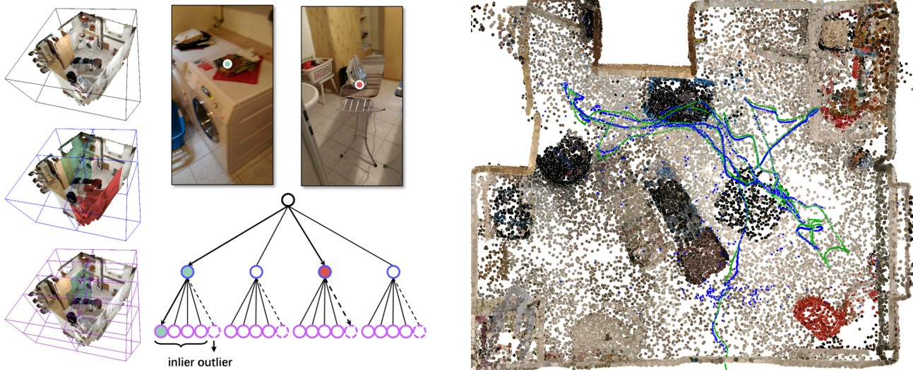
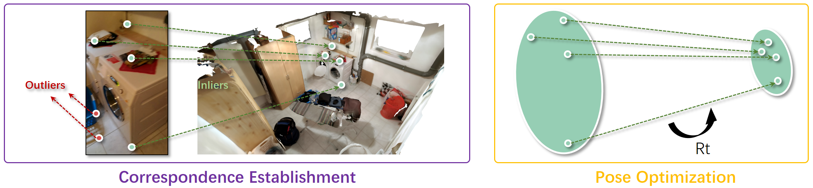

## [CVPR 2021 Oral] [Robust Neural Routing Through Space Partitions for Camera Relocalization in Dynamic Indoor Environments](https://arxiv.org/abs/2012.04746)

\*[Siyan Dong](https://siyandong.github.io/), \*[Qingnan Fan](https://fqnchina.github.io/), [He Wang](https://ai.stanford.edu/~hewang/), [Ji Shi](http://blog.sjj118.com/), [Li Yi](https://ericyi.github.io/), 
[Thomas Funkhouser](https://www.cs.princeton.edu/~funk/), [Baoquan Chen](http://cfcs.pku.edu.cn/baoquan/), [Leonidas J. Guibas](https://geometry.stanford.edu/member/guibas/)

\* Equal Contribution



We provide the implementation of NeuralRouting, a novel outlier-aware neural tree model to estimate camera pose in dynamic environments. 
The model builds on three important blocks: (a) a hierarchical space partition over the indoor scene to construct a decision tree; (b) a neural routing function, implemented as a deep classification network, employed for better 3D scene understanding; and (c) an outlier rejection module used to filter out dynamic points during the hierarchical routing process. After establishing camera-to-world 3D-3D correspondences, a Kabsch based RANSAC is applied to solve the camera pose. 



Overall, our algorithm consists of two steps: a scene coordinate regressor for 3D-3D correspondence establishment and a Kabsch-based RANSAC algorithm for camera pose optimization. The coordinate regressor is scene-specific and learned in each scene. At inference time, the camera pose is estimated by running the coordinate regressor and the RANSAC algorithm.


## Citation

If you find our work helpful in your research, please consider citing:
```
@InProceedings{Dong_2021_CVPR,
    author    = {Dong, Siyan and Fan, Qingnan and Wang, He and Shi, Ji and Yi, Li and Funkhouser, Thomas and Chen, Baoquan and Guibas, Leonidas J.},
    title     = {Robust Neural Routing Through Space Partitions for Camera Relocalization in Dynamic Indoor Environments},
    booktitle = {Proceedings of the IEEE/CVF Conference on Computer Vision and Pattern Recognition (CVPR)},
    month     = {June},
    year      = {2021},
    pages     = {8544-8554}
}
```


## Requirements

The code in this repository is tested on Python 3.7.3, PyTorch 1.1.0, CUDA 10.0, OpenCV 4.5.1, and scikit-learn 0.21.2. 
We recommend running our code in the Docker container [siyandong/neuralrouting:ransac_v0.2](https://hub.docker.com/repository/docker/siyandong/neuralrouting).
```
docker run -v <dataset folder>:/opt/dataset -it --gpus all --rm --entrypoint /bin/bash --name <container name> siyandong/neuralrouting:ransac_v0.2
```
In the container, run ```source activate NeuralRouting``` to activate the environment.


## Dataset

The data follows the format of the [RIO10 benchmark](http://vmnavab26.in.tum.de/RIO10/benchmarks.php). To use the code, please download the dataset first. 

We apply a random transformation to the original ground-truth camera poses. Set the ```dataset_folder``` in ```random_transformation.py``` to the dataset folder, for example ```dataset_folder = '/opt/dataset'```.

Run the script
```
python random_transformation.py
```

Set the ```dataset_folder``` in ```config.py``` to the dataset folder before training and test.


## Training

In the training stage, we build the space partition tree and train the neural routing functions to memorize the static points while rejecting dynamic ones. 

Set ```dataset_folder``` and ```scene_id``` in ```config.py```. 

Run the script
```
python train.py --exp_name <checkpoint folder>
```
For example, ```python train.py --exp_name rio10_scene01```.

It will build the tree, train it level by level, and save the model parameters in the folder ```./experiment/<checkpoint folder>```.

You can find the pre-trained checkpoints [here](todo).


## Test

### Correspondence Establishment

Set ```dataset_folder``` and ```scene_id``` in ```config.py```. 

Run the script
```
python test.py --exp_name <checkpoint folder> --test_seq <sequence name>
```
For example, ```python test.py --exp_name rio10_scene01 --test_seq seq01_02```.

It will infer pixel-wise scene coordinates (as GMM) and save them in the folder ```./gmm_prediction```.


### Pose Optimization

The pose optimization code is based on the RANSAC in [spaint](https://github.com/torrvision/spaint). You should run this part of code in the Docker container [siyandong/neuralrouting:ransac_v0.2](https://hub.docker.com/repository/docker/siyandong/neuralrouting).
In the container, run the following commands
```
cd /opt/relocalizer_codes/spaint
python run_ransac.py --data_folder_mask <dataset folder mask> --scene_id <scene id> --sequence_id <sequence id> --prediction_folder <gmm prediction folder>
```
For example, ```python run_ransac.py --data_folder_mask /opt/dataset/scene{:02d}/seq{:02d}/seq{:02d}_{:02d} --scene_id 1 --sequence_id 2 --prediction_folder /opt/relocalizer_codes/NeuralRouting/gmm_prediction/rio10_scene01_seq01_02```.

It will output the estimated camera poses in the folder ```/opt/relocalizer_codes/spaint/build/bin/apps/relocgui/reloc_poses```.


### ICP Refinement

This module is based on [spaint](https://github.com/torrvision/spaint) and [InfiniTAM](https://github.com/victorprad/InfiniTAM). You should run this part of code in the Docker container [siyandong/neuralrouting:ransac_icp_v0.0](https://hub.docker.com/repository/docker/siyandong/neuralrouting). In the container, run the following commands
```
cd /opt/relocalizer_codes/spaint
python run_ransac_icp.py --data_folder_mask <dataset folder mask> --scene_id <scene id> --sequence_id <sequence id> --prediction_folder <gmm prediction folder>
```
For example, ```python run_ransac_icp.py --data_folder_mask /opt/dataset/scene{:02d}/seq{:02d} --scene_id 1 --sequence_id 2 --prediction_folder /opt/relocalizer_codes/NeuralRouting/gmm_prediction/rio10_scene01_seq01_02```.

It will output the estimated camera poses in the folder ```/opt/relocalizer_codes/spaint/build/bin/apps/spaintgui/reloc_poses```.


<!--More Space Partition Strategies-->


<!--To compute scene bounding box and radius-->

